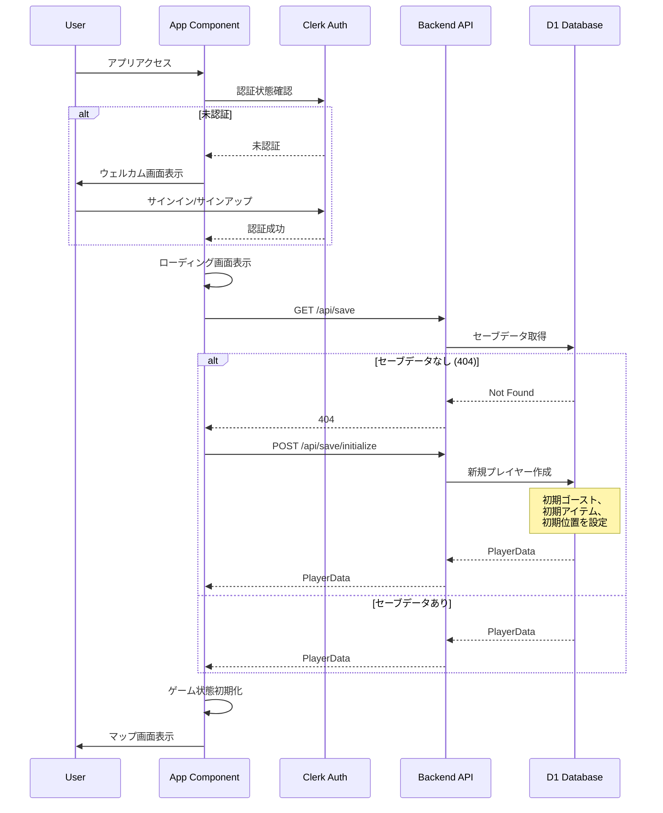

# Design Document: Ghost Game

## Overview

**Purpose**: ブラウザ上で動作する2D RPG「Ghost」を提供し、ゴーストの収集・育成・バトルを楽しめるゲーム体験を実現する。

**Users**: カジュアルゲーマーがブラウザから直接アクセスし、モンスター収集・ターン制バトルを楽しむ。

**Impact**: 新規ゲームアプリケーションとして、既存のサンプルコード（タスク管理API）を置き換え、フルゲームシステムを構築する。

### Goals
- グリッドベースマップでの探索とエンカウントシステムの実装
- タイプ相性を活用したターン制コマンドバトルの実現
- ゴーストの捕獲・育成・パーティ管理機能の提供
- WASDキー操作による直感的なゲームプレイ

### Non-Goals
- マルチプレイヤー対戦（将来検討）
- ストーリーモード・クエストシステム（初期スコープ外）
- モバイルタッチ操作対応（キーボード操作優先）
- サーバー間通信によるリアルタイム同期（オフラインファースト）

## Architecture

### Architecture Pattern & Boundary Map


**Architecture Integration**:
- **Selected pattern**: Feature-Sliced + Component Composition（ドメイン単位でモジュール分割、Reactコンポーネント合成）
- **Domain/feature boundaries**: Map（探索）、Battle（戦闘）、Party（パーティ管理）、Inventory（アイテム）の4ドメイン
- **Existing patterns preserved**: Hono API handler pattern、Drizzle ORM schema pattern
- **New components rationale**: ゲームロジックは純粋関数として`game/`に集約、UIコンポーネントは`components/`に配置
- **Steering compliance**: TypeScript strict mode、ゲームロジック分離、テスト可能設計

### Technology Stack

| Layer | Choice / Version | Role in Feature | Notes |
|-------|------------------|-----------------|-------|
| Frontend | React 19 | ゲームUI描画、状態管理 | useReducer + Context |
| Frontend | Tailwind CSS 4.x | UIスタイリング | ユーティリティファースト |
| Frontend | CSS Grid | グリッドマップ描画 | Tailwindと併用 |
| Schema | Zod 3.x | データバリデーション | フロント/バックエンド共通スキーマ |
| Backend | Hono 4.x + RPC | 型安全なAPI通信 | `hc`クライアントで型推論 |
| Auth | Clerk | ユーザー認証・セッション管理 | ソーシャルログイン対応 |
| Data | Cloudflare D1 | プレイヤー・セーブデータ永続化 | SQLite互換 |
| Bundler | Vite 7 | 開発サーバー・ビルド | 既存設定継続 |
| CI/CD | GitHub Actions | 自動テスト・デプロイ | main/developブランチ対応 |

## System Flows

### バトルフロー


### マップ移動フロー


### 認証・ゲーム開始フロー



## Requirements Traceability

| Requirement | Summary | Components | Interfaces | Flows |
|-------------|---------|------------|------------|-------|
| 1.1-1.5 | マップ探索・移動 | MapScreen, MapGrid, useMapState | MapState, TileData | マップ移動フロー |
| 2.1-2.5 | ゴースト基本データ | - | Ghost, GhostSpecies, Stats | - |
| 3.1-3.6 | タイプ相性 | - | GhostType, TypeEffectiveness | バトルフロー |
| 4.1-4.8 | ターン制バトル | BattleScreen, usesBattleState | BattleState, BattleCommand | バトルフロー |
| 5.1-5.6 | ゴースト捕獲 | CapturePanel | CaptureResult | バトルフロー |
| 6.1-6.5 | パーティ管理 | PartyScreen, GhostCard | Party, PartySlot | - |
| 7.1-7.6 | アイテム | ItemPanel, useInventory | Item, Inventory | バトルフロー |
| 8.1-8.6 | 経験値・レベルアップ | - | Experience, LevelUp | バトルフロー |
| 9.1-9.4 | 逃げる | - | EscapeResult | バトルフロー |
| 10.1-10.5 | ゲーム画面・UI | GameContainer, MessageBox | GameScreen, KeyboardInput | - |
| 11.1-11.5 | プレイヤー登録・初期化 | PlayerInitService (Backend) | InitializePlayerRequest, PlayerData | 認証フロー |
| 12.1-12.6 | 認証状態・画面遷移 | App, LoadingScreen, useAuthState | AuthState, AppScreen | 認証フロー |
| 13.1-13.5 | セーブデータ永続化 | useSaveData, SaveAPI | SaveData, SaveRequest | - |

## Components and Interfaces

### Summary Table

| Component | Domain/Layer | Intent | Req Coverage | Key Dependencies | Contracts |
|-----------|--------------|--------|--------------|------------------|-----------|
| GameContainer | UI | ゲーム画面の切り替え管理 | 10.1 | useGameState (P0) | State |
| MapScreen | UI/Map | マップ表示と移動処理 | 1.1-1.5 | useMapState (P0), MapGrid (P1) | State |
| MapGrid | UI/Map | グリッドタイル描画 | 1.4, 1.5 | TileData (P0) | - |
| BattleScreen | UI/Battle | バトル画面全体 | 4.1, 4.2, 10.2-10.3 | useBattleState (P0) | State |
| CommandPanel | UI/Battle | コマンド選択UI | 4.2, 4.3 | BattleCommand (P0) | - |
| PartyScreen | UI/Party | パーティ管理画面 | 6.1-6.3 | usePartyState (P0) | State |
| useGameState | Hook | ゲーム全体状態管理 | 10.1 | - | State |
| useMapState | Hook | マップ状態管理 | 1.1-1.3 | mapLogic (P0) | State |
| useBattleState | Hook | バトル状態管理 | 4.1-4.8 | battleLogic (P0) | State |
| battleLogic | Logic | ダメージ計算・ターン処理 | 3.3-3.6, 4.4-4.8 | typeChart (P0) | Service |
| captureLogic | Logic | 捕獲成功率計算 | 5.2-5.5 | - | Service |
| levelUpLogic | Logic | 経験値・レベルアップ処理 | 8.1-8.6 | - | Service |
| useAuthState | Hook | 認証状態と画面遷移管理 | 12.1-12.6 | useSaveData (P0) | State |
| LoadingScreen | UI | ローディング表示 | 12.5 | - | - |
| playerInitService | Backend/Service | 新規プレイヤー初期化 | 11.1-11.5 | D1 Database (P0) | API |

### UI Layer

#### GameContainer

| Field | Detail |
|-------|--------|
| Intent | ゲーム画面（Map/Battle/Menu）の切り替えを管理 |
| Requirements | 10.1 |

**Responsibilities & Constraints**
- 現在のゲーム画面状態に応じて適切なScreenコンポーネントを描画
- 画面遷移時のトランジション効果を適用

**Dependencies**
- Inbound: App — ルートコンポーネント (P0)
- Outbound: MapScreen, BattleScreen, PartyScreen — 各画面 (P0)

**Contracts**: State [x]

##### State Management
```typescript
type GameScreen = "map" | "battle" | "party" | "menu";

interface GameState {
  currentScreen: GameScreen;
  player: PlayerState;
  party: Party;
  inventory: Inventory;
}

type GameAction =
  | { type: "CHANGE_SCREEN"; screen: GameScreen }
  | { type: "UPDATE_PARTY"; party: Party }
  | { type: "UPDATE_INVENTORY"; inventory: Inventory };
```

#### MapScreen

| Field | Detail |
|-------|--------|
| Intent | グリッドマップの表示とプレイヤー移動処理 |
| Requirements | 1.1, 1.2, 1.3, 1.4, 1.5 |

**Responsibilities & Constraints**
- WASDキー入力を受け取りプレイヤーを移動
- 移動先タイルの判定（壁/草むら/通常）
- エンカウント判定とバトル画面への遷移トリガー

**Dependencies**
- Inbound: GameContainer — 画面表示 (P0)
- Outbound: MapGrid — タイル描画 (P1)
- Outbound: useMapState — 状態管理 (P0)

**Contracts**: State [x]

##### State Management
```typescript
interface MapState {
  currentMapId: string;
  playerPosition: Position;
  tiles: TileData[][];
}

interface Position {
  x: number;
  y: number;
}

interface TileData {
  type: TileType;
  walkable: boolean;
  encounterRate: number;
}

type TileType = "grass" | "ground" | "wall" | "water";

type MapAction =
  | { type: "MOVE"; direction: Direction }
  | { type: "LOAD_MAP"; mapId: string };

type Direction = "up" | "down" | "left" | "right";
```

#### BattleScreen

| Field | Detail |
|-------|--------|
| Intent | バトル画面の表示とターン制バトル進行 |
| Requirements | 4.1, 4.2, 10.2, 10.3 |

**Responsibilities & Constraints**
- プレイヤーと野生ゴーストの情報表示（HP、名前、レベル）
- コマンド選択UIの表示
- バトルメッセージの表示

**Dependencies**
- Inbound: GameContainer — 画面表示 (P0)
- Outbound: useBattleState — バトル状態 (P0)
- Outbound: CommandPanel — コマンド選択 (P1)
- Outbound: MessageBox — メッセージ表示 (P1)

**Contracts**: State [x]

##### State Management
```typescript
interface BattleState {
  phase: BattlePhase;
  playerGhost: BattleGhost;
  enemyGhost: BattleGhost;
  turnOrder: TurnOrder;
  messages: string[];
  canEscape: boolean;
}

type BattlePhase =
  | "command_select"
  | "move_select"
  | "item_select"
  | "executing"
  | "result"
  | "ended";

interface BattleGhost {
  ghost: Ghost;
  currentHp: number;
  maxHp: number;
}

type BattleAction =
  | { type: "SELECT_COMMAND"; command: BattleCommand }
  | { type: "SELECT_MOVE"; moveId: string }
  | { type: "EXECUTE_TURN" }
  | { type: "END_BATTLE"; result: BattleResult };

type BattleCommand = "fight" | "item" | "run" | "capture";
type BattleResult = "win" | "lose" | "escape" | "captured";
```

### Logic Layer

#### battleLogic

| Field | Detail |
|-------|--------|
| Intent | ダメージ計算、タイプ相性、ターン順序決定 |
| Requirements | 3.3, 3.4, 3.5, 3.6, 4.4, 4.5, 4.6 |

**Responsibilities & Constraints**
- 純粋関数として実装（副作用なし）
- 入力データから計算結果を返す
- タイプ相性表を参照してダメージ倍率を適用

**Dependencies**
- Inbound: useBattleState — バトル計算呼び出し (P0)
- External: typeChart — 相性データ (P0)

**Contracts**: Service [x]

##### Service Interface
```typescript
interface BattleLogicService {
  calculateDamage(
    attacker: BattleGhost,
    defender: BattleGhost,
    move: Move
  ): DamageResult;

  determineTurnOrder(
    playerGhost: BattleGhost,
    enemyGhost: BattleGhost
  ): TurnOrder;

  getTypeEffectiveness(
    attackType: GhostType,
    defenderType: GhostType
  ): TypeEffectiveness;
}

interface DamageResult {
  damage: number;
  effectiveness: TypeEffectiveness;
  isCritical: boolean;
}

type TypeEffectiveness = "super_effective" | "normal" | "not_effective" | "no_effect";
type TurnOrder = "player_first" | "enemy_first";
```

#### captureLogic

| Field | Detail |
|-------|--------|
| Intent | 捕獲成功率の計算 |
| Requirements | 5.2, 5.3, 5.4, 5.5 |

**Responsibilities & Constraints**
- 野生ゴーストのHP残量に応じて成功率を計算
- 捕獲アイテムの性能を加味

**Contracts**: Service [x]

##### Service Interface
```typescript
interface CaptureLogicService {
  calculateCaptureRate(
    targetGhost: BattleGhost,
    captureItem: Item
  ): number;

  attemptCapture(
    targetGhost: BattleGhost,
    captureItem: Item
  ): CaptureResult;
}

interface CaptureResult {
  success: boolean;
  shakeCount: number;
}
```

#### levelUpLogic

| Field | Detail |
|-------|--------|
| Intent | 経験値計算とレベルアップ処理 |
| Requirements | 8.1, 8.2, 8.3, 8.4, 8.5 |

**Contracts**: Service [x]

##### Service Interface
```typescript
interface LevelUpLogicService {
  calculateExpGain(
    defeatedGhost: Ghost,
    participantLevel: number
  ): number;

  checkLevelUp(
    ghost: Ghost,
    expGained: number
  ): LevelUpResult;

  calculateStats(
    species: GhostSpecies,
    level: number
  ): Stats;
}

interface LevelUpResult {
  leveledUp: boolean;
  newLevel: number;
  newStats: Stats;
  learnableMoves: Move[];
}
```

### Authentication & Initialization Layer

#### useAuthState

| Field | Detail |
|-------|--------|
| Intent | 認証状態に基づいてアプリ画面を制御し、ゲーム開始フローを管理 |
| Requirements | 12.1, 12.2, 12.3, 12.4, 12.5, 12.6 |

**Responsibilities & Constraints**
- Clerk認証状態を監視し、適切な画面を決定
- 認証成功時にセーブデータ読み込みをトリガー
- セーブデータがない場合に新規プレイヤー初期化を実行
- エラー発生時のリトライ機能を提供

**Dependencies**
- Inbound: App — ルートコンポーネント (P0)
- Outbound: useSaveData — セーブデータ操作 (P0)
- External: @clerk/clerk-react — 認証状態 (P0)

**Contracts**: State [x]

##### State Management
```typescript
type AppScreen = "welcome" | "loading" | "game" | "error";

interface AuthState {
  /** 認証済みかどうか */
  isAuthenticated: boolean;
  /** 認証読み込み中 */
  isAuthLoading: boolean;
  /** 現在表示すべき画面 */
  currentScreen: AppScreen;
  /** セーブデータ読み込み済みかどうか */
  isDataLoaded: boolean;
  /** エラーメッセージ */
  error: string | null;
}

type AuthAction =
  | { type: "AUTH_LOADING" }
  | { type: "AUTH_SUCCESS" }
  | { type: "AUTH_SIGNED_OUT" }
  | { type: "DATA_LOADING" }
  | { type: "DATA_LOADED" }
  | { type: "DATA_ERROR"; error: string }
  | { type: "RETRY" };
```

#### LoadingScreen

| Field | Detail |
|-------|--------|
| Intent | セーブデータ読み込み中のローディング表示 |
| Requirements | 12.5 |

**Responsibilities & Constraints**
- ローディングアニメーションの表示
- 読み込み状態のテキスト表示（「データを読み込み中...」）

**Dependencies**
- Inbound: App — 条件付きレンダリング (P0)

**Implementation Notes**
- シンプルなプレゼンテーショナルコンポーネント
- Tailwind CSSのアニメーションユーティリティを使用

#### playerInitService (Backend)

| Field | Detail |
|-------|--------|
| Intent | 新規プレイヤーの初期データ作成とデータベース登録 |
| Requirements | 11.1, 11.2, 11.3, 11.4, 11.5 |

**Responsibilities & Constraints**
- Clerk UserIDに紐づいた新規プレイヤーレコード作成
- 初期ゴースト（レベル5、ランダムまたは固定種族）の付与
- 初期アイテム（ゴーストボール×5、ポーション×3）の付与
- 初期マップと開始位置の設定

**Dependencies**
- Inbound: Hono API Handler (P0)
- Outbound: D1 Database — データ永続化 (P0)
- External: Drizzle ORM — DB操作 (P0)

**Contracts**: API [x]

##### API Contract
| Method | Endpoint | Request | Response | Errors |
|--------|----------|---------|----------|--------|
| POST | /api/save/initialize | - (Clerk Auth Header) | PlayerData | 401, 409, 500 |

##### Service Interface
```typescript
interface PlayerInitService {
  /**
   * 新規プレイヤーを初期化する
   * @param userId Clerk User ID
   * @returns 作成されたプレイヤーデータ
   * @throws ConflictError 既にプレイヤーが存在する場合
   */
  initializePlayer(userId: string): Promise<PlayerData>;
}

interface InitialPlayerConfig {
  /** 初期ゴーストの種族ID */
  starterGhostSpeciesId: string;
  /** 初期ゴーストのレベル */
  starterGhostLevel: number;
  /** 初期アイテム */
  starterItems: Array<{ itemId: string; quantity: number }>;
  /** 初期マップID */
  startMapId: string;
  /** 開始位置 */
  startPosition: Position;
}

// デフォルト設定
const DEFAULT_INITIAL_CONFIG: InitialPlayerConfig = {
  starterGhostSpeciesId: "fireling", // ヒダマリン
  starterGhostLevel: 5,
  starterItems: [
    { itemId: "ghost_ball", quantity: 5 },
    { itemId: "potion", quantity: 3 },
  ],
  startMapId: "starter_town",
  startPosition: { x: 5, y: 5 },
};
```

## Data Models

### Domain Model


### Logical Data Model (Zod Schemas)

**Core Entities** - Zodスキーマで定義し、フロントエンド・バックエンドで共有:

```typescript
import { z } from "zod";

// ゴーストタイプ
export const GhostTypeSchema = z.enum([
  "fire",
  "water",
  "grass",
  "electric",
  "ghost",
  "normal",
]);
export type GhostType = z.infer<typeof GhostTypeSchema>;

// 能力値
export const StatsSchema = z.object({
  hp: z.number().int().positive(),
  attack: z.number().int().positive(),
  defense: z.number().int().positive(),
  speed: z.number().int().positive(),
});
export type Stats = z.infer<typeof StatsSchema>;

// 技
export const MoveSchema = z.object({
  id: z.string(),
  name: z.string(),
  type: GhostTypeSchema,
  power: z.number().int().min(0),
  accuracy: z.number().int().min(0).max(100),
  pp: z.number().int().positive(),
});
export type Move = z.infer<typeof MoveSchema>;

// ゴースト種族マスタ
export const GhostSpeciesSchema = z.object({
  id: z.string(),
  name: z.string(),
  type: GhostTypeSchema,
  baseStats: StatsSchema,
  learnableMoves: z.array(z.object({
    moveId: z.string(),
    level: z.number().int().positive(),
  })),
});
export type GhostSpecies = z.infer<typeof GhostSpeciesSchema>;

// プレイヤー所持ゴースト
export const GhostSchema = z.object({
  id: z.string(),
  speciesId: z.string(),
  nickname: z.string().nullable(),
  level: z.number().int().min(1).max(100),
  exp: z.number().int().min(0),
  currentHp: z.number().int().min(0),
  stats: StatsSchema,
  moves: z.array(z.string()).max(4),
});
export type Ghost = z.infer<typeof GhostSchema>;

// アイテム種別
export const ItemTypeSchema = z.enum(["healing", "capture", "other"]);
export type ItemType = z.infer<typeof ItemTypeSchema>;

// アイテム
export const ItemSchema = z.object({
  id: z.string(),
  name: z.string(),
  type: ItemTypeSchema,
  effect: z.object({
    healAmount: z.number().int().optional(),
    captureBonus: z.number().optional(),
  }),
});
export type Item = z.infer<typeof ItemSchema>;

// パーティ
export const PartySchema = z.object({
  slots: z.array(GhostSchema.nullable()).max(6),
});
export type Party = z.infer<typeof PartySchema>;

// インベントリ
export const InventorySchema = z.object({
  items: z.record(z.string(), z.number().int().min(0)),
});
export type Inventory = z.infer<typeof InventorySchema>;
```

### Physical Data Model (Backend - D1)

```sql
-- プレイヤーセーブデータ
CREATE TABLE players (
  id TEXT PRIMARY KEY,
  name TEXT NOT NULL,
  position_x INTEGER NOT NULL DEFAULT 0,
  position_y INTEGER NOT NULL DEFAULT 0,
  current_map_id TEXT NOT NULL,
  created_at TEXT NOT NULL DEFAULT (datetime('now')),
  updated_at TEXT NOT NULL DEFAULT (datetime('now'))
);

-- 所持ゴースト
CREATE TABLE player_ghosts (
  id TEXT PRIMARY KEY,
  player_id TEXT NOT NULL REFERENCES players(id),
  species_id TEXT NOT NULL,
  nickname TEXT,
  level INTEGER NOT NULL DEFAULT 1,
  exp INTEGER NOT NULL DEFAULT 0,
  current_hp INTEGER NOT NULL,
  stat_hp INTEGER NOT NULL,
  stat_attack INTEGER NOT NULL,
  stat_defense INTEGER NOT NULL,
  stat_speed INTEGER NOT NULL,
  move_1 TEXT,
  move_2 TEXT,
  move_3 TEXT,
  move_4 TEXT,
  party_slot INTEGER, -- NULL if in box
  created_at TEXT NOT NULL DEFAULT (datetime('now'))
);

-- 所持アイテム
CREATE TABLE player_items (
  player_id TEXT NOT NULL REFERENCES players(id),
  item_id TEXT NOT NULL,
  quantity INTEGER NOT NULL DEFAULT 1,
  PRIMARY KEY (player_id, item_id)
);
```

## Error Handling

### Error Strategy
- **入力検証**: ゲームコマンドの妥当性をロジック層で検証
- **状態整合性**: 不正な状態遷移を防ぐためのガード条件
- **グレースフルデグラデーション**: API接続失敗時はローカルプレイを継続

### Error Categories and Responses

| Category | Scenario | Response |
|----------|----------|----------|
| User Input | 無効なコマンド | 無視して再入力待ち |
| Game State | HP0のゴーストで攻撃 | 交代を強制 |
| Network | セーブ失敗 | リトライ + ローカルキャッシュ |
| Data | マスタデータ不整合 | フォールバック値使用 |

## Testing Strategy

### Unit Tests
- `battleLogic.calculateDamage`: タイプ相性によるダメージ計算
- `battleLogic.getTypeEffectiveness`: 相性表参照
- `captureLogic.calculateCaptureRate`: HP残量による捕獲率
- `levelUpLogic.calculateExpGain`: 経験値計算
- `levelUpLogic.calculateStats`: レベルによる能力値計算

### Integration Tests
- `useMapState` + `mapLogic`: 移動とエンカウント発生
- `useBattleState` + `battleLogic`: バトル進行フロー
- パーティ変更 → バトル開始時のゴースト反映

### E2E Tests
- マップ探索 → エンカウント → バトル → 勝利 → 経験値獲得
- 野生ゴースト捕獲 → パーティ追加
- アイテム使用 → HP回復

## Security Considerations

### Authentication (Clerk)
- **認証フロー**: Clerkのプリビルトコンポーネントでサインイン/サインアップ
- **セッション管理**: ClerkのセッショントークンをAPIリクエストに付与
- **保護対象エンドポイント**: セーブデータの読み書き（`/api/save/*`）

```typescript
// Backend: Clerk認証ミドルウェア
import { clerkMiddleware } from "@hono/clerk-auth";

app.use("/api/save/*", clerkMiddleware());
app.get("/api/save", async (c) => {
  const auth = c.get("clerkAuth");
  if (!auth?.userId) {
    return c.json({ error: "Unauthorized" }, 401);
  }
  // userId でセーブデータを取得
});
```

### API Security
- Hono RPC によるエンドポイント型安全性
- Zod バリデーションで入力検証
- CORS 設定で許可オリジンを制限

## CI/CD Pipeline (GitHub Actions)

### Workflow Overview


### Pipeline Stages

| Stage | Tool | Description |
|-------|------|-------------|
| Quality Check | Biome | Lint + Format チェック |
| Type Check | tsc | TypeScript コンパイル |
| Unit Test | Vitest | テスト実行 |
| Integration Test | Vitest | 統合テスト |
| Build | Vite / Wrangler | Frontend / Backend ビルド |
| Deploy | Cloudflare | Pages / Workers デプロイ |

### Branch Strategy
- `main`: 本番デプロイ
- `develop`: プレビューデプロイ
- `feature/*`: PR 時に CI 実行（デプロイなし）

## Performance & Scalability

### Targets
- 初期ロード: 3秒以内
- マップ移動レスポンス: 16ms以内（60fps維持）
- バトルコマンド応答: 100ms以内

### Optimization Strategies
- マスタデータは初回ロード時にメモリキャッシュ
- マップタイルは可視範囲のみ描画
- React.memoでコンポーネント再描画を最適化
- Tailwind CSS の JIT コンパイルで未使用スタイル除去
